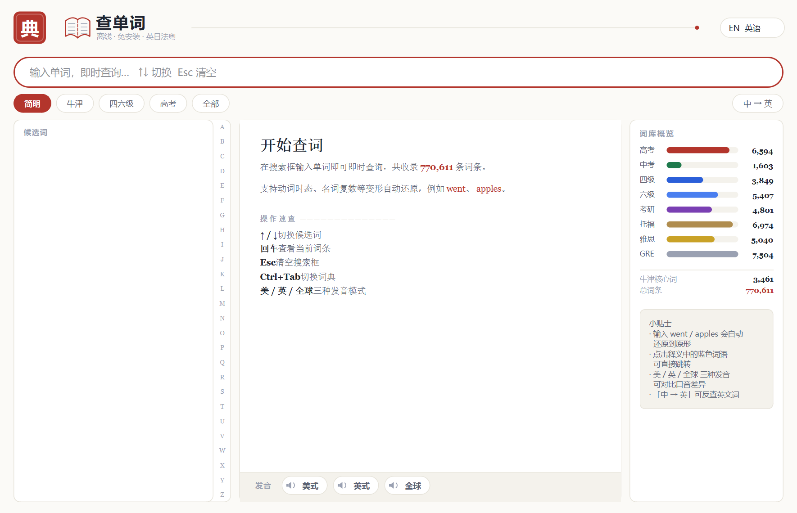
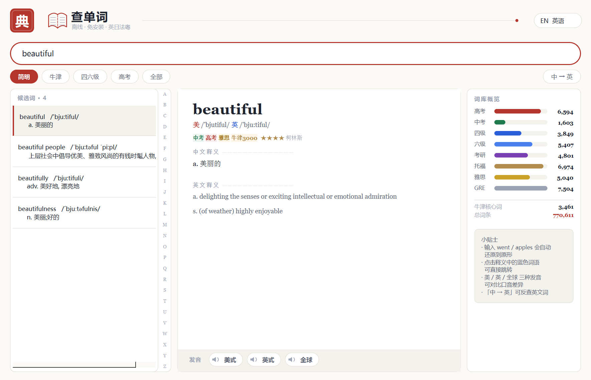
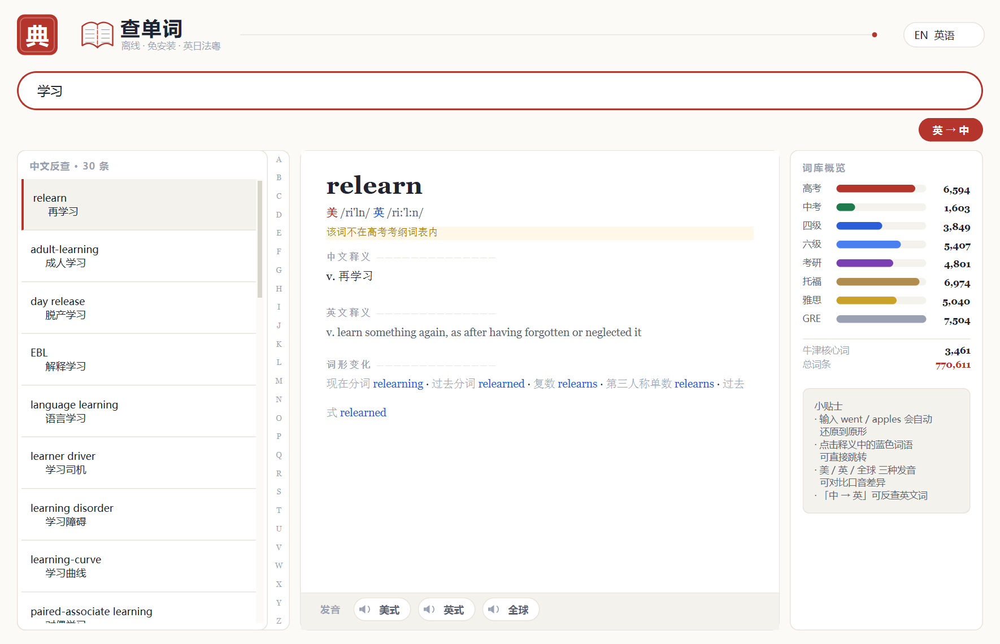
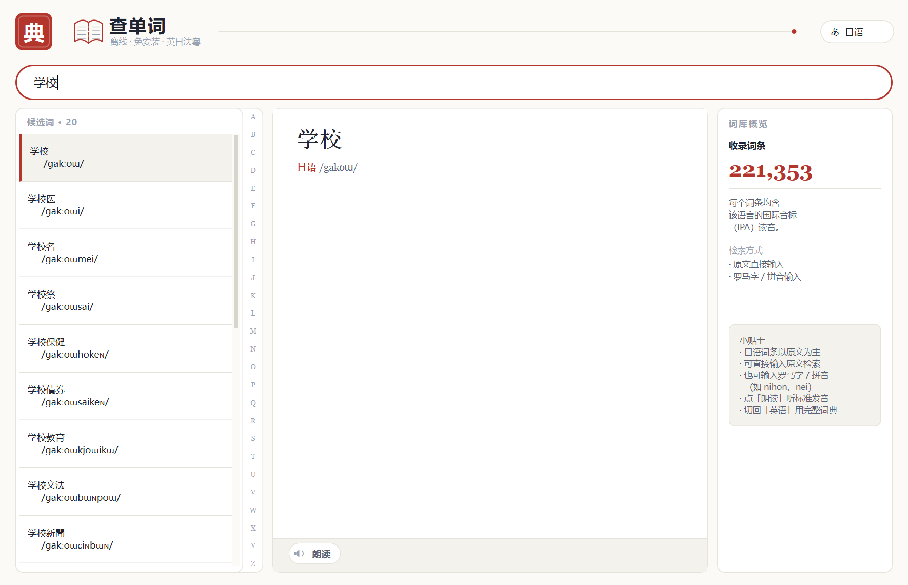

# 查单词 · 多语言离线词典

**Windows 桌面词典 · 免安装单文件 exe · 英 / 日 / 法 / 粤 四种语言模式**

一个用 Python + PySide6 + SQLite 写的**离线优先**桌面词典。查词、音标、例句、短语、
单词本全部在本机完成，不依赖网络；发音、整句翻译、AI 问答等增强功能按需联网，
且**只在你主动使用时才发出请求**。

界面为「纸墨」风格：摊开的书 + 金色放大镜 + 红色「典」字印章。

---

## ✨ 特性

| | |
|---|---|
| **自动识别中英方向** | 输入 `dog` 出释义，输入「狗」自动反查出 dog，无需手动切换 |
| **大词库** | 英语 77 万词条（含考纲标签 / BNC 词频）+ 18.7 万条词形还原数据 |
| **多语言** | 日语 22 万、法语 24 万、粤语 5.6 万条，支持罗马字检索（`nihon` → 日本） |
| **双音标** | 25.6 万条带英美双音标，其中 9.8 万条英美读音不同 |
| **真实例句** | 7.7 万条中英对照句对（Tatoeba），覆盖 1.6 万个常用词，离线可查 |
| **常用短语** | 取自词库自带 36.6 万个多词词条，约六成常用词可查 |
| **变形词智能还原** | `chipped` 有独立义项就展示自己的词条，`went` 这类纯变形指针才跳原形，并给「查看原形」入口 |
| **整句翻译** | 多通道兜底（MyMemory / 有道），带**译文质量闸门**：译得不对就如实报错，不拿例句冒充译文 |
| **14 种英文口音发音** | Edge 神经语音真人级别朗读 + 有道真人录音 + 本地 TTS |
| **单词本 / 搜索历史** | 分组管理、整表还原、性能护栏 |
| **撤销** | 误删能一键恢复，跳转错了能退回来（导航栈一并还原） |
| **AI 助手** | DeepSeek 站内对话（填 Key）或跳转网页版（零配置） |

---

## 🖼️ 界面预览

**首页** —— 纸墨风格，左侧候选词按字母索引，右侧词库概览用条形图展示各考纲词量分布



**词条详情** —— 英美双音标、考纲标签、中英双释义，底部三种发音模式



**中文反查** —— 输入「学习」直接列出英文对应表达，点开即看完整词条



**日语模式** —— 支持原文与罗马字双路检索，每个词条带国际音标



---

## 🚀 快速开始

### 方式一：下载 Release 安装包（最省事，无需 Python、无需 Git LFS）

前往 **[Releases](https://github.com/hexiaodong2778/chinese-english-dictionary/releases/latest)**
下载 `chaword-v1.2.0-win64.zip`（约 523 MB），解压后双击 **`查单词.exe`** 即可。

> ⚠️ 四个 `.db` 词库文件必须和 `查单词.exe` **放在同一目录**，否则程序无法启动查词。
> 解压时请保持压缩包内的目录结构。

### 方式二：克隆仓库（约 533 MB，需先装 Git LFS）

本仓库的词库与 exe 通过 **Git LFS** 托管，克隆前请先安装 git-lfs：

```bash
git lfs install
git clone https://github.com/hexiaodong2778/chinese-english-dictionary.git
```

若未安装 git-lfs，克隆下来的大文件只会是几百字节的**指针文件**，程序无法运行。
（因此**推荐用方式一**，那条通道不占 Git LFS 的免费流量额度。）

---

## 📁 目录结构

```
chinese-english-dictionary/
├── 查单词.exe              # 主程序（单文件，免安装）
├── dict.db                 # 英语词库  ~399 MB（LFS）
├── dict_ja.db              # 日语词库  ~33 MB （LFS）
├── dict_fr.db              # 法语词库  ~32 MB （LFS）
├── dict_yue.db             # 粤语词库  ~7 MB  （LFS）
├── 使用说明.txt            # 面向使用者的详细说明（约 1.1 万字）
├── dict_config.example.json# 配置模板（复制为 dict_config.json 后填自己的 Key）
├── LICENSE
└── build/                  # 全部源码、测试与工具链
    ├── app.py              # 主程序（约 8.6 千行，含 UI 与引擎）
    ├── app.spec            # PyInstaller 打包配置
    ├── app_icon.ico        # 应用图标（7 个尺寸）
    ├── version_info.txt    # 版本资源（1.2.0.0）
    ├── build_dict.py       # 英语词库构建
    ├── build_langs.py      # 日 / 法 / 粤 词库构建
    ├── build_examples*.py  # 例句库构建
    ├── build_cn_sense.py   # 中文义项倒排索引
    ├── clean_ipa.py / fetch_ipa.py   # 音标清洗与补全
    ├── test_*.py           # 55 个测试脚本
    ├── _run_all2.py        # 全量回归入口
    ├── _quick.py           # 指定脚本快速回归
    └── _deploy_final.py    # 打包产物部署 + 自检
```

---

## 🔨 从源码构建

### 环境

- **Python 3.13**（本仓库在 3.13.12 上开发）
- **PySide6**（Qt for Python）
- **PyInstaller**（打包）
- Windows 10 / 11 x64

```bash
cd build
pip install pyside6 pyinstaller
python app.py                    # 直接以源码运行
```

### 打包为单文件 exe

```bash
cd build
python -m PyInstaller app.spec --noconfirm \
       --distpath dist --workpath pyi_build
```

产物在 `build/dist/查单词.exe`，把它连同四个 `.db` 词库放到同一目录即可分发。

> exe 内置了三个免 GUI 自检开关，可在命令行验证打包结果：
> ```bash
> 查单词.exe --selftest-v2   v2.txt   # 引擎 / 多语言 / 变形策略 / 译文闸门
> 查单词.exe --selftest-cn   cn.txt   # 中文反查
> 查单词.exe --selftest-edge edge.txt # 发音通道
> 查单词.exe --selftest-ai   ai.txt   # AI 通道
> ```
> 全部通过时输出 `RESULT OK`。**源码测试通过 ≠ exe 能跑**，打包后务必跑一遍。

---

## 📚 重建词库

词库由公开语料离线构建，脚本均在 `build/` 下。先准备素材：

| 素材 | 来源 | 用途 |
|---|---|---|
| `ecdict.csv` | [skywind3000/ECDICT](https://github.com/skywind3000/ECDICT) | 英语词条与释义（MIT） |
| `ipa/*.txt` | [open-dict-data/ipa-dict](https://github.com/open-dict-data/ipa-dict) | 音标补全（MIT） |
| `cmn-eng.zip` | [manythings.org/anki](https://www.manythings.org/anki/) | 中英句对（CC-BY 2.0 FR） |
| Tatoeba 全量导出 | [Tatoeba](https://tatoeba.org/) 周更包 | 扩充例句库 |
| `lemma.en.txt` | ECDICT | 词形还原表 |

然后依次执行：

```bash
python build_dict.py          # → dict.db（英语）
python build_examples.py      # → 例句小包（3.2 万句）
python build_examples_big.py  # → 例句扩充（Tatoeba 全量）
python build_cn_sense.py      # → 中文义项倒排索引
python fetch_ipa.py           # 下载音标
python clean_ipa.py           # 音标清洗归一
python build_langs.py         # → dict_ja.db / dict_fr.db / dict_yue.db
```

---

## ⚙️ 配置

复制模板并按需填写，**改完保存、重启软件即生效**：

```bash
cp dict_config.example.json dict_config.json
```

| 字段 | 说明 |
|---|---|
| `youdao_app_key` / `youdao_app_secret` | 有道翻译 API（[ai.youdao.com](https://ai.youdao.com/) 免费额度约 500 次/天）。填了就获得稳定整句中英互译，支持日 / 法 |
| `deepseek_api_key` | DeepSeek API Key（[platform.deepseek.com](https://platform.deepseek.com)），填后可在软件内直接与 AI 对话 |
| `edge_accent` | 底部发音栏下拉框自动写回，无需手改 |
| `proxy` | 形如 `http://127.0.0.1:7890`，访问境外站点不通时填 |
| `tip_collapsed` | 右侧小贴士折叠状态，界面自动写回 |

> **所有项都可以留空**，留空即走默认兜底，不会报错。

---

## ✅ 运行测试

### ⚠️ 跨机器运行前，先做一次路径重定位

仓库里 100 多个测试与工具脚本原为**一台特定开发机**编写，内含
`D:\Dictionary\build`、`D:\hclaw\python\python.exe` 这类绝对路径
（代码逻辑没问题，但换台机器会因为找不到路径而跑不起来）。
在新机器上跑测试前，先执行一次自动重定位（被改动的文件会自动备份）：

```bash
cd build
python _relocate.py
```

改写对应关系：

| 脚本里写死的 | 会被改成 |
|---|---|
| `D:\Dictionary\build` | 本仓库的 `build/` 目录 |
| `D:\Dictionary` | 本仓库根目录 |
| `D:\hclaw\python\python.exe` | 你本机的 `python.exe` |

> `app.py` 本身**不含**任何硬编码路径（词库按 exe / 脚本所在目录查找），
> 所以**下载 exe 直接用**、**clone 后直接 `python app.py`** 都不受此影响 ——
> 只有「想跑测试套件」才需要这一步。

### 跑测试

```bash
cd build
python _run_all2.py                              # 全量回归：55 个脚本
python _quick.py test_engine.py test_smoke.py    # 只跑指定脚本
```

`_run_all2.py` 自动发现 `test_*.py` 与 `verify_*.py`，新增测试无需登记。

**基线：55 个脚本 / 974 PASS / 0 FAIL / 真失败 0。**

读汇总时请看 **`真失败`** 这个数，不要看 `超时未退出`：
`test_edge_tts.py` 会「跑完但进程退不出」（Qt FFmpeg 媒体线程持着 GIL
不放），它靠自己写下的产物文件判定，单列一档，**不算失败**。

---

## 📜 数据来源与许可

**程序源代码**：MIT License（见 [LICENSE](LICENSE)）。

**随附词库数据**包含以下第三方开放数据，各自遵循其原始许可：

| 数据 | 来源 | 许可 |
|---|---|---|
| 英语词条与释义 | [ECDICT](https://github.com/skywind3000/ECDICT) | MIT |
| 日语 / 法语 / 粤语音标 | [ipa-dict](https://github.com/open-dict-data/ipa-dict) | MIT |
| 中英对照例句 | [Tatoeba](https://tatoeba.org/)（经 manythings.org 打包） | CC-BY 2.0 (France) |
| 中文词条参考 | CC-CEDICT | CC-BY-SA 4.0 |

使用时请保留上述署名。**英美真人发音录音**取自有道词典公开音频接口，仅供学习使用，
网络发音的可用性依赖第三方服务，本项目不对其稳定性作保证。

> 若你计划将本项目用于商业分发，请自行确认上述数据许可的适用性
> （尤其是 CC-BY-SA 的 share-alike 条款）。

---

## ⚠️ 已知限制

- **中 → 粤翻译**：免费通道（MyMemory）对粤语只做简繁转换，给不出粤式表达。
  程序会明确告知，不会糊弄你。中 ⇄ 粤的可靠翻译需要自备翻译 API。
- **法语机翻质量**：免费通道常把法语当英语处理，程序内置译文质量闸门会拒收劣质结果
  并说明原因。建议自备有道 API 获得稳定译文。
- **词库体积**：仓库约 533 MB，首次克隆需拉取 LFS 对象。
  GitHub 免费账户 LFS 配额为存储 1 GB / 月流量 1 GB，多人克隆可能触及上限。
  只是**想用**的话建议直接下载 Releases 里的 zip。
- **平台**：仅 Windows。代码基于 PySide6，理论上可移植到 macOS / Linux，
  但发音通道（SAPI / Edge TTS）与图标资源需要另行适配。

---

## 📄 更多文档

面向使用者的完整说明（约 1.1 万字，含每个功能的细节、踩坑记录与常见问题）
见仓库根目录的 **[使用说明.txt](使用说明.txt)**。
